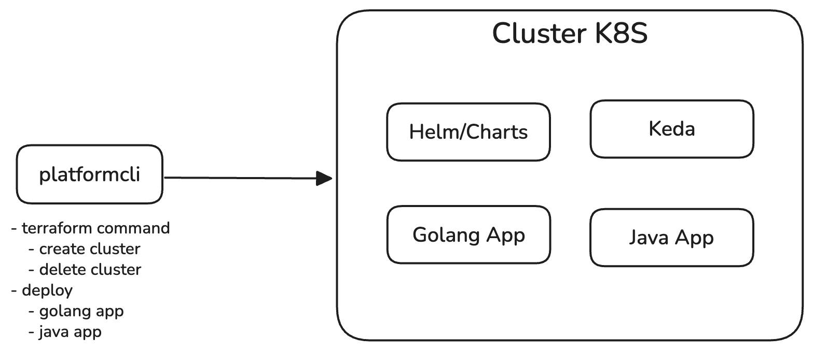

# Kubernetes Infrastructure Lab

A comprehensive infrastructure lab for building and managing Kubernetes clusters with automated deployment pipelines using modern DevOps tools and practices.

## Overview

This project demonstrates a complete Kubernetes infrastructure setup with Infrastructure as Code (Terraform), containerization (Docker), and multiple application deployment strategies.

---

## Architecture Diagrams

### Simple Workflow

> ⚠️ **Status**: In progress

### Kubernetes Architecture

> ⚠️ **Status**: In progress

---

## Tech Stack

| Component | Purpose |
|-----------|---------|
| **Terraform** | Infrastructure as Code (IaC) |
| **Kubernetes** | Container orchestration |
| **Minikube** | Local Kubernetes development |
| **Helm** | Kubernetes package management |
| **KEDA** | Kubernetes Event Autoscaling |
| **Docker** | Container runtime & image management |
| **Golang** | Backend services |
| **Java** | Backend services |

---

## Getting Started

### Prerequisites
- Docker
- kubectl
- Terraform
- Minikube (for local development)
- Helm

### Platform CLI

The Platform CLI provides commands to manage your Kubernetes cluster and deployments.

#### Terraform Commands
```bash
# Create a new cluster
platform terraform create

# Delete the cluster
platform terraform delete
```

#### Deployment Commands
```bash
# Deploy Golang application
platform deploy golang

# Deploy Java application
platform deploy java
```

---

## Project Structure

```
k8s-infra-lab/
├── terraform/          # Infrastructure configuration
├── platformcli/        # CLI to manage cluster
├── applications/
│   ├── golang/        # Go applications
│   └── java/          # Java applications
└── diagrams/          # Architecture diagrams
```

---

## Status

🚧 **This project is under active development**

- [ ] Finalize architecture diagrams
- [ ] Document deployment procedures
- [ ] Add sample applications
- [ ] Complete CI/CD pipeline

---